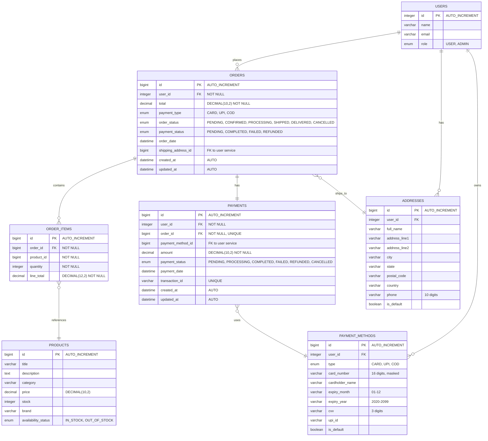

# Database Schema - Order Payment Service

## 🗄️ **Mermaid SQL Diagram**



## 📊 **Table Details**

### **ORDERS Table**
```sql
CREATE TABLE orders (
    id BIGINT PRIMARY KEY AUTO_INCREMENT,
    user_id INTEGER NOT NULL,
    total DECIMAL(10,2) NOT NULL,
    payment_type ENUM('CARD', 'UPI', 'COD'),
    order_status ENUM('PENDING', 'CONFIRMED', 'PROCESSING', 'SHIPPED', 'DELIVERED', 'CANCELLED') DEFAULT 'PENDING',
    payment_status ENUM('PENDING', 'COMPLETED', 'FAILED', 'REFUNDED') DEFAULT 'PENDING',
    order_date DATETIME,
    shipping_address_id BIGINT,
    created_at DATETIME DEFAULT CURRENT_TIMESTAMP,
    updated_at DATETIME DEFAULT CURRENT_TIMESTAMP ON UPDATE CURRENT_TIMESTAMP,
    
    FOREIGN KEY (user_id) REFERENCES users(id),
    FOREIGN KEY (shipping_address_id) REFERENCES addresses(id)
);
```

### **ORDER_ITEMS Table**
```sql
CREATE TABLE order_items (
    id BIGINT PRIMARY KEY AUTO_INCREMENT,
    order_id BIGINT NOT NULL,
    product_id BIGINT NOT NULL,
    quantity INTEGER NOT NULL,
    line_total DECIMAL(12,2) NOT NULL,
    
    FOREIGN KEY (order_id) REFERENCES orders(id) ON DELETE CASCADE,
    FOREIGN KEY (product_id) REFERENCES products(id)
);
```

### **PAYMENTS Table**
```sql
CREATE TABLE payments (
    id BIGINT PRIMARY KEY AUTO_INCREMENT,
    user_id INTEGER NOT NULL,
    order_id BIGINT NOT NULL UNIQUE,
    payment_method_id BIGINT,
    amount DECIMAL(10,2) NOT NULL,
    payment_status ENUM('PENDING', 'PROCESSING', 'COMPLETED', 'FAILED', 'REFUNDED', 'CANCELLED') DEFAULT 'PENDING',
    payment_date DATETIME,
    transaction_id VARCHAR(255) UNIQUE,
    created_at DATETIME DEFAULT CURRENT_TIMESTAMP,
    updated_at DATETIME DEFAULT CURRENT_TIMESTAMP ON UPDATE CURRENT_TIMESTAMP,
    
    FOREIGN KEY (user_id) REFERENCES users(id),
    FOREIGN KEY (order_id) REFERENCES orders(id) ON DELETE CASCADE,
    FOREIGN KEY (payment_method_id) REFERENCES payment_methods(id)
);
```

## 🎯 **Key Relationships**

1. **Order ↔ OrderItems**: One-to-Many (One order has many items)
2. **Order ↔ Payment**: One-to-One (One order has one payment)
3. **Order → User**: Many-to-One (Many orders belong to one user)
4. **Order → Address**: Many-to-One (Many orders can ship to one address)
5. **Payment → PaymentMethod**: Many-to-One (Many payments can use one payment method)

## ✅ **Data Consistency**

### **Foreign Keys:**
- ✅ `orders.user_id` → `users.id` (Integer)
- ✅ `orders.shipping_address_id` → `addresses.id` (Long)
- ✅ `payments.user_id` → `users.id` (Integer)
- ✅ `payments.order_id` → `orders.id` (Long, UNIQUE)
- ✅ `payments.payment_method_id` → `payment_methods.id` (Long)
- ✅ `order_items.order_id` → `orders.id` (Long)
- ✅ `order_items.product_id` → `products.id` (Long)

### **Validation Rules:**
- ✅ **Phone**: Exactly 10 digits
- ✅ **Card Number**: Exactly 16 digits
- ✅ **CVV**: Exactly 3 digits
- ✅ **UPI ID**: Email format
- ✅ **User ID**: Integer (FK)

## 🧹 **No Redundancy Found**

Your code is **clean and well-organized**:
- ✅ **No duplicate DTOs**
- ✅ **No unused services**
- ✅ **No redundant interfaces**
- ✅ **Proper separation of concerns**
- ✅ **Consistent naming conventions**
- ✅ **All relationships properly mapped**

## 💰 **Refund Status Fix Applied**

The refund bug is now fixed. After cancellation, you'll see:
```json
{
  "orderStatus": "CANCELLED",
  "paymentStatus": "REFUNDED",  // ✅ Now consistent
  "payment": {
    "paymentStatus": "REFUNDED"  // ✅ Also consistent
  }
}
```

**Your database design is solid and your code is clean with no redundancy!** 🎉 