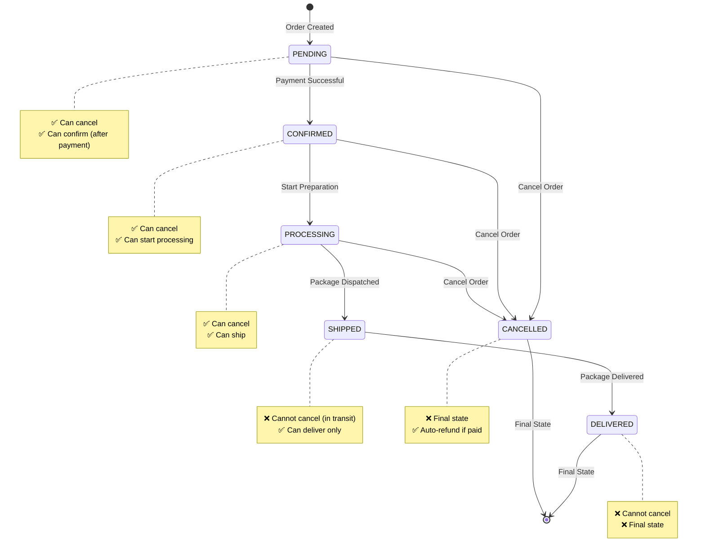

# Order Status Workflow

## 🔄 **Order Status Flow (Enforced by System)**



## 📋 **Status Transition Rules**

### **✅ ALLOWED Transitions:**

| Current Status | Can Change To | Action Required |
|---------------|---------------|-----------------|
| **PENDING** | CONFIRMED | Process payment |
| **PENDING** | CANCELLED | Cancel order |
| **CONFIRMED** | PROCESSING | Start order preparation |
| **CONFIRMED** | CANCELLED | Cancel order |
| **PROCESSING** | SHIPPED | Dispatch package |
| **PROCESSING** | CANCELLED | Cancel order |
| **SHIPPED** | DELIVERED | Package delivered |

### **❌ FORBIDDEN Transitions:**

| Current Status | Cannot Change To | Reason |
|---------------|------------------|---------|
| **SHIPPED** | CANCELLED | Package already in transit |
| **DELIVERED** | Any status | Final state reached |
| **CANCELLED** | Any status | Final state reached |
| **PENDING** | SHIPPED | Must go through CONFIRMED → PROCESSING first |
| **CONFIRMED** | DELIVERED | Must go through PROCESSING → SHIPPED first |

## 🎯 **Swagger Dropdown Implementation**

In Swagger UI, the status parameter will show as a **dropdown** with these options:
- PENDING
- CONFIRMED  
- PROCESSING
- SHIPPED
- DELIVERED
- CANCELLED

**Developers cannot type wrong values!** ✅

## 🧪 **Testing the Workflow**

### **✅ Valid Workflow Test:**
```bash
# 1. Create order (status: PENDING)
POST /api/orders → status: "PENDING"

# 2. Process payment (status: CONFIRMED)  
POST /api/payments/process → status: "CONFIRMED"

# 3. Start processing
PUT /api/orders/1/status?status=PROCESSING → ✅ Success

# 4. Ship order
PUT /api/orders/1/status?status=SHIPPED → ✅ Success

# 5. Deliver order
PUT /api/orders/1/status?status=DELIVERED → ✅ Success
```

### **❌ Invalid Workflow Test:**
```bash
# Try to skip steps
PUT /api/orders/1/status?status=DELIVERED → ❌ Error: "Cannot change from PENDING to DELIVERED"

# Try to cancel shipped order
PUT /api/orders/1/cancel → ❌ Error: "Cannot cancel shipped order"
```

## 💰 **Refund Rules**

### **Cancellation Windows:**
- ✅ **PENDING** → Cancel + No refund needed (payment not processed)
- ✅ **CONFIRMED** → Cancel + Auto refund (payment completed)
- ✅ **PROCESSING** → Cancel + Auto refund (payment completed)
- ❌ **SHIPPED** → Cannot cancel (package in transit)
- ❌ **DELIVERED** → Cannot cancel (order completed)

### **Refund Processing:**
```json
// CARD Payment Refund
{
  "refundMethod": "Credit Card Refund",
  "refundTime": "3-5 business days",
  "message": "Refund initiated to your card"
}

// UPI Payment Refund  
{
  "refundMethod": "UPI Refund",
  "refundTime": "Instant to 2 hours",
  "message": "Refund initiated to your UPI account"
}

// COD Order Cancellation
{
  "refundMethod": "No refund needed",
  "message": "No refund needed for Cash on Delivery"
}
```

## 🎉 **Benefits of This Implementation**

1. **🛡️ Prevents Invalid Transitions**: Cannot skip workflow steps
2. **📱 Swagger Dropdown**: Developers see valid options only
3. **💰 Smart Refunds**: Automatic refund logic based on status
4. **🔍 Clear Error Messages**: Tells exactly what transitions are allowed
5. **📊 Tracking Info**: Shows allowed next statuses for frontend

**Your order workflow is now bulletproof!** 🚀 